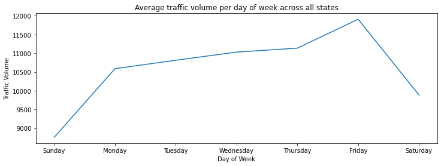

# US Traffic (2015)

The repository contains analysis of traffic volume trends from [2015 US traffic data](https://www.kaggle.com/jboysen/us-traffic-2015) with simple proofs-of-concept (PoC) to show possibility of using the data for forecasting. Additional insights are also included in this README to show possible use cases and how to extend our findings.

Results of the analysis and models may be reproduced by following the steps under *1. Prerequisites* then *2. Usage guide*. It's also possible to look at the *3. Summary of findings* section to check the overview of the repository contents.

## Table of Contents

- [1. Prerequisites]()
  - [1.1 Dependencies]()
  - [1.2 Download the dataset]()
- [2. Usage guide]()
- [3. Summary of findings]()
  - [3.1 Data Patterns and Feature Engineering]()
    - [3.1.1 Temporal]()
    - [3.1.2 Spatial]()
    - [3.1.3 Features for forecasting]()
  - [3.2 Forecasting PoC]()
  - [3.3 Insights and recommendations]()

## 1. Prerequisites

### 1.1 Dependencies

1. Install the latest stable version of Python 3 and Jupyter in the system. Additionally, the user can also opt to create and activate a [conda environment](https://docs.conda.io/projects/conda/en/latest/user-guide/getting-started.html) for testing. 
2. Install the required libraries. Ensure that there are proper permissions and certificates (if needed) when installing.
```
pip install -r .\requirements.txt
```

### 1.2 Download the dataset

The user can download the [Kaggle dataset](https://www.kaggle.com/jboysen/us-traffic-2015) manually and unpack the files to *us-traffic\src\data* or **download the data through the following script**:
```
python ./src/datasetdownloader.py -d "<git-repo-directory>/us-traffic/src/data/"
```
Modify the command above with the appropriate <git-repo-directory> value. For ease of use, the notebooks have a default configuration that sets the data directory as *src/data* relative to the *us-traffic* folder location as shown above. The user can also opt to modify the `DATA_LOCATION` variables in the notebook when testing if the data is located somewhere else.

## 2. Usage guide

The repository contains the following structure:

```
us-traffic
│   
└───imgs
│   └───eda
│   │   └─── ...
└───src
|   |   datasetdownloader.py
|   |   preprocess_trafficdata.py
│   │   ...
│   │
│   └───data 
|   │   |    dot_traffic_2015.txt.gz
|   │   |    dot_traffic_stations_2015.txt.gz
│   │   |
|   │   └─── ...
│   │
│   └───html 
│   └───notebooks 
|   │   |    1. EDA.ipynb
|   │   |    2. Feature Engineering.ipynb
|   │   |    3. Forecasting models.ipynb
|   │   └─── ...
│   └───utils
|   ...
...
```

`data` - Contains the data used for analysis. In this repository, other data such as *fips_code.csv* and *fips_latlong.csv* were manually collected and verified through available government websites to cross check state names per FIPS state code and approximate coordinates per state.
  
`html` - Since map plots in Jupyter Notebooks are not visible through GitHub, HTML files are provided to access the dynamic graphs (e.g. station plots which were based on and modified from [this notebook](https://www.kaggle.com/frankcorrigan/end-to-end-data-science-project)).
  
`notebooks` - Contains Jupyter notebooks for the analysis. The notebooks are numbered in order of how it should be run.
  
`utils` - Contains utility functions used by the files under `notebooks`. Separated for easier reuse.

## 3. Summary of findings

### 3.1 Data Patterns

#### 3.1.1 Temporal




#### 3.1.2 Spatial


#### 3.1.3 Features for forecasting

### 3.2 Forecasting PoC
  
### 3.3 Insights and recommendations
