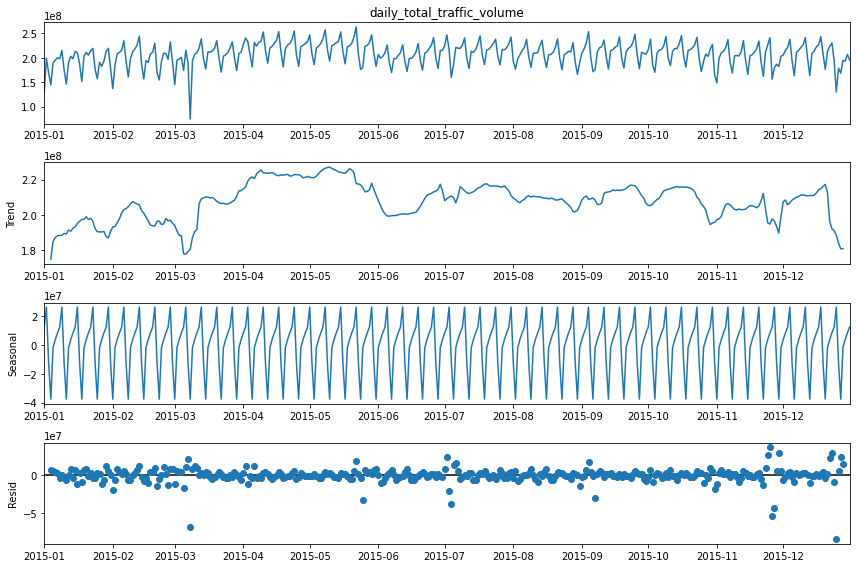

# US Traffic (2015)

<p align="center"></p>

The repository contains analysis of traffic volume trends from [2015 US traffic data](https://www.kaggle.com/jboysen/us-traffic-2015) with simple proofs-of-concept (PoC) to show possibility of using the data for forecasting. Additional insights are also included in this README to show possible use cases and how to extend our findings.

Results of the analysis and models may be reproduced by following the steps under *1. Prerequisites* then *2. Usage guide*. It's also possible to look at the *3. Summary of findings* section to check the overview of the repository contents.

## Table of Contents

- [1. Prerequisites]()
  - [1.1 Dependencies]()
  - [1.2 Download the dataset]()
- [2. Usage guide]()
- [3. Summary of findings]()
  - [3.1 Data Patterns and Feature Engineering]()
    - [3.1.1 Temporal]()
    - [3.1.2 Spatial]()
    - [3.1.3 Features for forecasting]()
  - [3.2 Forecasting PoC]()
  - [3.3 Insights and recommendations]()

## 1. Prerequisites

### 1.1 Dependencies

1. Install the latest stable version of Python 3 and Jupyter in the system. Additionally, the user can also opt to create and activate a [conda environment](https://docs.conda.io/projects/conda/en/latest/user-guide/getting-started.html) for testing. 
2. Install the required libraries. Ensure that there are proper permissions and certificates (if needed) when installing.
```
pip install -r .\requirements.txt
```

### 1.2 Download the dataset

The user can download the [Kaggle dataset](https://www.kaggle.com/jboysen/us-traffic-2015) manually and unpack the files to *us-traffic\src\data* or **download the data through the following script**:
```
python ./src/datasetdownloader.py -d "<git-repo-directory>/us-traffic/src/data/"
```
Modify the command above with the appropriate <git-repo-directory> value. For ease of use, the notebooks have a default configuration that sets the data directory as *src/data* relative to the *us-traffic* folder location as shown above. The user can also opt to modify the `DATA_LOCATION` variables in the notebook when testing if the data is located somewhere else.

## 2. Usage guide

The repository contains the following structure:

```
us-traffic
│   
└───imgs
│   └───anims
│   └───eda
│   │   └─── ...
└───src
|   |   datasetdownloader.py
|   |   preprocess_trafficdata.py
│   │   ...
│   │
│   └───data 
|   │   |    dot_traffic_2015.txt.gz
|   │   |    dot_traffic_stations_2015.txt.gz
│   │   |
|   │   └─── ...
│   │
│   └───html 
│   └───notebooks 
|   │   |    1. EDA.ipynb
|   │   |    2. Feature Engineering.ipynb
|   │   |    3. Forecasting models.ipynb
|   │   └─── ...
│   └───utils
|   ...
...
```

`data` - Contains the data used for analysis. In this repository, other data such as *fips_code.csv* and *fips_latlong.csv* were manually collected and verified through available government websites to cross check state names per FIPS state code and approximate coordinates per state.
  
`html` - Since map plots in Jupyter Notebooks are not visible through GitHub, HTML files are provided to access the dynamic graphs (e.g. station plots which were based on and modified from [this notebook](https://www.kaggle.com/frankcorrigan/end-to-end-data-science-project)).
  
`notebooks` - Contains Jupyter notebooks for the analysis. The notebooks are numbered in order of how it should be run.
  
`utils` - Contains utility functions used by the files under `notebooks`. Separated for easier reuse.

## 3. Summary of findings

### 3.1 Data Patterns

During our initial analysis, we can see from the data that there are hourly entries for traffic volume data collected by stations for a given state in the US for the entire year of 2015. Per state, there are counties and more spatial information such as urban vs. rural, longitude, and latitude values. Upon checking the data, there are gaps between daily entries but no null values were found for the hourly entries. Sample distribution plots for some states with incomplete entries for 2015 are shown below.
  
<p align="center"></p>
  
While there are 0 and negative values for the hourly entries, we assume that the sensors for each station are properly calibrated and leave those values untouched as these values may be intentional per station. We also assume that while stations may have different sensors, the traffic volume data entries are normalized to be of the same unit in the dataset.

#### 3.1.1 Temporal

To understand the general behavior of the data, data points are initially aggregated for analysis. If we were to plot the entire traffic data according to states and/or stations, we wouldn't be able to visually see the trends due to the amount of lines in the graph. In this case, a dataframe was retrieved by grouping the traffic data points by date (to retrieve 365 points), aggregating the traffic volume by collecting the total daily traffic volume, and transforming the data to retrieve the hourly entries.

- **Days of Month**
  
    Since we retrieved the hourly entries, we can compare the behavior across days in a month. The following plot shows a comparison of hourly aggregated traffic volume for different days in January 2015. The lines in this plot correspond to data from a specific day. Upon checking other months, it can be seen that visually there seems to be some patterns depending on the day. We move onto other temporal features to confirm our initial assumptions regarding the data.

<p align="center"></p>
  
- **Day of Week**
   
  Since the day of week values in the dataset are encoded numerically, we determine the matches during EDA to supplement the day names for graphs. From the plot below we can see that the traffic volume for weekends (Sunday and Saturday) are lower compared to their weekday counterparts. Additionally, there seems to be a slightly higher volume during Friday. This may be attributed to more casual plans occurring during Fridays as it signals the end of the weekday.
  
<p align="center"></p>

- **Day of Week and Hour of Day**
  
   We can further check the behavior of the traffic volume per hour during the day of week. We can see here that there is a significantly lower traffic volume during early mornings during the weekend. This may be attributed to activities such as schools and regular office hours only occuring during the weekdays, thus lowering the traffic volume during weekends.
  
<p align="center"></p>
  
  During different parts of the day, the trends for the traffic volume differs e.g. for hours during midnight to early morning (0-5AM), it can be seen that the traffic is low since most human activities such as regular office hours and school occur during morning to afternoon from Monday to Friday. This can be further verified by seeing the spike in traffic volume around midmornings (7-9AM) during weekdays wherein public transportation such as buses/taxis and private vehicles are being used to go to [schools](https://www.ciee.org/typical-day-school), [business establishments, offices](https://htir.com/articles/business-hours.php), and others. After stable traffic volumes during early afternoon (11AM-3PM), there are sudden spikes as people most likely return home after their time outside and slowly winding down further as it goes on to the night. 
  
<p align="center"></p>
  
  Our initial assumptions regarding the temporal behavior of the data seems to match the general behavior of the data visually during aggregation and from articles regarding regular American working hours. To make it more visually apparent, we also show the average traffic volume per hour for weekday and weekend comparison from the animation above.

- **Seasonal Decomposition**
  
<p align="center"></p>

#### 3.1.2 Spatial
While checking the traffic stations, it was seen that there were some entries with common patterns of incorrect longitude and latitude data. This was verified by collecting external data by matching the FIPS state codes to their approximate longitude and latitude.

The following plots show the incorrect longitude and latitude values for Delaware (FIPS state code 10) and South Dakota (FIP state 46). 
<p align="center"></p>
<p align="center"></p>
 

<p align="center"></p>
<p align="center"></p>
<p align="center"></p>
  alabama
  arizona
<p align="center">
<p align="center">

#### 3.1.3 Features for forecasting

### 3.2 Forecasting PoC
  
### 3.3 Insights and recommendations
